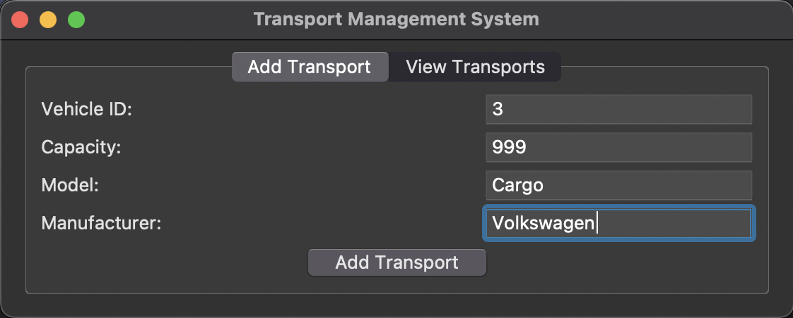
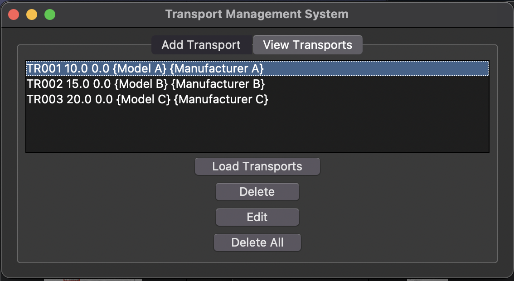

# Cargo Manager 

Программа Cargo Manager представляет собой систему управления грузовыми транспортными средствами для логистической компании.

С ее помощью можно легко добавлять, просматривать, редактировать и удалять данные о транспорте.

## Функционал

- **Добавление транспорта**: Добавление новых грузовых транспортных средств с указанием их характеристик.
- **Просмотр транспорта**: Просмотр всех доступных грузовых транспортных средств и их основных характеристик.
- **Редактирование данных**: Возможность изменения информации о существующих транспортных средствах.
- **Удаление транспорта**: Удаление выбранных грузовых транспортных средств из базы данных.

## Использование

1. Запустите приложение, выполните `python main.py` и `python gui.py`.
2. Используйте графический интерфейс для управления грузовыми транспортными средствами.
